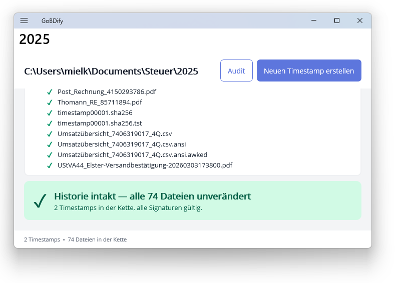

# GoBDify — eine Hilfs-App für die GoBD-konforme Dokumentenarchivierung

[](https://www.gnu.org/licenses/agpl-3.0)


## Worum geht's

GoBDify bildet über einen lokalen oder Cloud-Ordner eine veränderungssichere Historie aus SHA-256-Hashes und beglaubigt jeden Schritt mit einem RFC3161-Zeitstempel einer unabhängigen Zertifizierungsstelle. Damit lässt sich gegenüber Dritten nachweisen, dass die abgelegten Dokumente seit der Beglaubigung **nicht verändert** wurden — eine Kernanforderung der in Deutschland gültigen **GoBD** (*Grundsätze zur ordnungsmäßigen Führung und Aufbewahrung von Büchern, Aufzeichnungen und Unterlagen in elektronischer Form*) bzw. der **GeBüV** in der Schweiz oder **BAO/UGB** in Österreich.

Die Lösung besteht aus drei Komponenten in einer Solution:

- **GoBDify** — die MAUI-Desktop-App mit Flyout-Navigation, hierarchischer
  Kettenansicht und Live-Statusanzeige während des Hashens.
- **GoBDify.Cli** — eine plattformübergreifende Kommandozeilen-Variante
  (Windows/Linux/macOS, jeweils x64 und arm64) für Skripting und Server-Audits.
- **GoBDify.Core** — die geteilte Bibliothek mit der eigentlichen Logik
  (Hash-Kette, RFC3161-Anbindung, Settings).



## Konzept

GoBDify nutzt sogenannte *hashes*, um ein GoBD-konformes Dokumentenmanagement zu erleichtern. Hashes sind kryptographisch sichere 'Quersummen' über Daten, d.h. sie lassen sich nicht durch gezielte Änderungen an den Daten reproduzieren. Damit können hashes dem Ziel der Veränderungssicherheit hilfreich sein. Es bedarf aber einer zusätzlichen Sicherheit, die verhindert, dass hashes nicht einfach neu erzeugt werden können.

Konkret baut die App sha256 hashes aus den zu archivierenden Dateien, z.B. in einem Cloud-Verzeichnis, das über das Burger-Menü ausgewählt wird, und speichert deren hashes in einer .sha256-Dateie, die mit dem Linux-Tool `sha256sum -c XXX.sha256` überprüft werden kann. Für die GoBD-Bedingung der veränderungssicheren Speicherung wird in einem zweiten Schritt ein hash auf die im ersten Schritt erstellte .sha256-Datei angefertigt und an eine Zertifizierungsautorität gesandt, die bestätig, dass der hash zu einem bestimmten Zeitpunkt einen bestimmten Wert hat (timestamping). Manipulationen der archivierten Dokumente führen also dazu, dass der entsprechende hash in der .sha256-Datei nicht mehr stimmt; und wird der hash des Dokuments in der .sha256-Datei geändert, stimmt  wiederum deren hash nicht mehr, wobei ein erneutes hashen nur zusammen mit der Erzeugung eines neuen timestamp möglich ist, was bei einer Buchprüfung auffallen dürfte. Neben den Archivdokumenten wird auch die jeweils letzte erzeugte .sha256-Datei gehasht, so dass sich eine art Blockchain bildet.

Voraussetzung für GoBD-Konformität ist allerdings, dass man die Dokumente zeitnah hasht, z.B. auch wenn man unterwegs ist. Deshalb ist geplant, neben der Desktop-App, in Zukunft eine mobile App zur Verfügung zu stellen.

## Features

- **Hash-Kette** pro Arbeitsverzeichnis als Folge von `timestampNNNNN.sha256`-
  Dateien — jede signiert mit RFC3161-Token einer unabhängigen TSA.
- **Live-Audit** beim Verzeichniswechsel: Pro Datei wird der Hash berechnet
  und gegen die hinterlegte Referenz geprüft; Status-Banner mit Aggregat
  (intakt / verändert / fehlt).
- **Mehrere TSAs vorkonfiguriert**: Certum, FreeTSA, DigiCert, Sectigo,
  GlobalSign, Apple, SSL.com.
- **Paranoia-Modus** für sicherheitskritische Anwendungen: Jeder Eintrag wird
  parallel bei drei unabhängigen Zertifizierungsstellen beglaubigt, so dass
  die Beweiskraft auch beim Ausfall oder Kompromittieren eines Anbieters
  erhalten bleibt.
- **Flyout-Navigation** mit Schnellzugriff auf zuletzt benutzte Verzeichnisse.
- **Abbrechbare Verarbeitung** mit Cancellation-Token.
- **CLI-Tool** `gobdify` für Skripting und CI/CD-Audits auf MacOS und Linux.
- **Standardkonform**: Die `.sha256`-Dateien sind kompatibel mit `sha256sum -c`,
  die `.tst`-Dateien mit `openssl ts -verify`.

## Installation

### Endbenutzer (Windows)

**Empfohlen — installieren mit Auto-Update:**

- [GoBDify für Windows x64](https://easyct.de/gobdify-gui-windows-x64.appinstaller)
- [GoBDify für Windows ARM64](https://easyct.de/gobdify-gui-windows-arm64.appinstaller)

Die heruntergeladene `.appinstaller`-Datei doppelklicken — der Windows-
AppInstaller-Dialog öffnet sich und installiert die signierte MSIX. Künftige
Versionen werden beim App-Start automatisch im Hintergrund nachgezogen.

Erfordert Windows 10 Version 1809 oder neuer.

**Alternative — manueller Download ohne Auto-Update:** Die signierte MSIX
aus dem [letzten Release](../../releases) (Datei
`gobdify-gui-X.Y.Z-windows-x64.msix` bzw. `-arm64`) per Doppelklick
installieren. Updates müssen dann manuell eingespielt werden.

### CLI

Self-contained Single-File-Binary für die Zielplattform aus dem Release
herunterladen, entpacken und ausführbar machen:

```bash
# Linux/macOS
chmod +x gobdify
./gobdify --help

# macOS zusätzlich, um Gatekeeper-Quarantäne zu entfernen:
xattr -d com.apple.quarantine gobdify
```

Windows: `gobdify.exe` direkt ausführen.

## Verwendung

### GUI

1. App starten — beim ersten Mal öffnet sich automatisch das Flyout zur
   Ordnerauswahl.
2. Arbeitsverzeichnis hinzufügen → automatischer Audit aller bisher
   beglaubigten Dateien läuft.
3. **„Neuen Timestamp erstellen"** beglaubigt alle bisher nicht
   getimestampten Dateien.
4. In den Einstellungen Timestamp-Anbieter wählen und ggf. Paranoia-Modus
   aktivieren.

### CLI

```bash
gobdify <ordner>                 # Audit + neue Dateien timestampen (Default)
gobdify <ordner> --audit         # nur prüfen, nichts schreiben
gobdify config show              # aktuelle Konfiguration anzeigen
gobdify config --set-tsa certum,digicert,freetsa --paranoia on
```

Exit-Codes: `0` ok, `2` Argumentfehler, `3` Konfigurationsfehler, `4` Fehler,
`5` Audit-Issues gefunden (sinnvoll für CI-Aufrufe).

## Verifikation ohne GoBDify

Die produzierten Artefakte sind reine Standardformate. Hashes prüfst du mit
Bordmitteln, Timestamps mit OpenSSL:

```bash
# Datei-Hashes prüfen
sha256sum -c timestamp00001.sha256

# RFC3161-Timestamp einer .sha256 verifizieren
openssl ts -verify \
    -data timestamp00001.sha256 \
    -in timestamp00001.sha256.tst \
    -CApath /etc/ssl/certs/
```

Im Paranoia-Modus existieren pro Eintrag drei `.tst`-Dateien mit den Suffixen
`_a`, `_b` und `_c` — alle drei lassen sich unabhängig voneinander
verifizieren.

## Entwicklung

```bash
git clone https://github.com/thomiel/GoBDify.git
cd GoBDify
dotnet build GoBDify.sln
```

Voraussetzungen für die MAUI-App auf Windows:
- Visual Studio 2022 17.12+ mit .NET MAUI-Workload (`dotnet workload install maui`)
- Single Project MSIX Packaging Tools für VS2022
  ([Marketplace](https://marketplace.visualstudio.com/items?itemName=ProjectReunion.MicrosoftSingleProjectMSIXPackagingToolsDev17))

### Tests

```bash
dotnet test --filter Category!=Network   # offline, ~2 s
dotnet test --filter Category=Network    # gegen alle TSAs
dotnet test                              # alle
```

### Release-Build

```bash
.\publizieren.bat
```

baut MSIX (Windows x64+arm64) und CLI (6 Targets) und legt alle Pakete unter
`dist\` ab — fertig für den Upload zu einem GitHub-Release.

## Mitwirken

Issues und Pull Requests willkommen. Bei Bug-Reports bitte Plattform,
Version (`gobdify config show` für die CLI bzw. das Hilfe-Menü der App) und
ein Minimalbeispiel angeben.

## Lizenz

GNU Affero GPL v3.0 — siehe [LICENSE](LICENSE).
